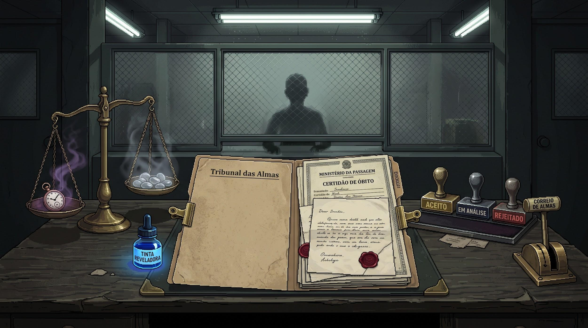

# High Concept Document — O Tribunal das Almas
**Disciplina:** Introdução ao Design e Desenvolvimento de Jogos (CSI507) — UFOP  
**Aluno:** João Miguel Barros de Lacerda  
**Data de Entrega:** 04/10/2026  

---

```
═════════════════════════════════════════════════════════════════════════
O TRIBUNAL DAS ALMAS
(Título de trabalho: Setor de Triagem 7)

TAGLINE:
"Em uma repartição atemporal do além, sua caneta e sua balança decidem 
quem merece o descanso eterno e quem será condenado ao expurgo."
═════════════════════════════════════════════════════════════════════════
```

## 1. Visão Geral (Pitch)
*O Tribunal das Almas* é um simulador investigativo e burocrático de tribunal moral em 2D, ambientado em uma repartição administrativa do além nos anos 1960. O jogador assume o papel do Auditor 404, um funcionário amnésico encarregado de examinar dossiês de almas recém-falecidas e decidir seu destino eterno — Repouso, Reencarnação ou Punição — sob a pressão do relógio de ponto, a vigilância de um inspetor implacável e o peso ético de suas próprias escolhas.

## 2. Gênero e Plataforma
- **Gênero:** Simulador Burocrático / Investigação Moral / *Document Thriller*
- **Perspectiva:** 1ª pessoa estática de bancada de trabalho (2D diegética de mesa de escritório)
- **Plataforma alvo:** PC (Windows / WebGL)
- **Modo de jogo:** *Singleplayer* narrativo
- **Duração estimada de partida:** 45 a 60 minutos (5 turnos de expediente de 8 a 12 minutos cada)

## 3. Público-Alvo
- **Faixa etária:** 16+ anos.
- **Perfil de jogador:** Fãs de jogos narrativos, experiências atmosféricas, *puzzle games* investigativos e dilemas éticos profundos.
- **Jogos de referência do público:** *Papers, Please*, *Death and Taxes*, *Return of the Obra Dinn*, *Beholder* e *Disco Elysium*.

## 4. Mecânica Central ("O Verbo do Jogo")
> **"Examinar documentos, pesar relíquias pessoais na Balança do Pesar e carimbar o destino eterno das almas."**

O jogador manipula fisicamente sobre a mesa a Certidão de Passamento, cartas íntimas e extratos morais; aplica a **Tinta Reveladora** para expor mentiras e rasuras; posiciona o objeto da alma na **Balança do Pesar** para medir seu fardo espiritual; e sela o veredito com um dos três carimbos oficiais acionando a alavanca pneumática de despacho.

## 5. História / Contexto
No Setor de Triagem 7, uma repartição brutalista cinzenta suspensa entre o mundo dos vivos e a eternidade, a mortalidade humana é catalogada com a frieza de um departamento público. O Auditor 404 cumpre sua função sem questionar nem se lembrar do passado, até que detalhes em prontuários começam a despertar fragmentos de sua própria morte. A rotina se desestabiliza quando entidades clandestinas oferecem subornos sob a mesa e o caso final do expediente coloca o auditor diante da alma diretamente responsável pela sua tragédia em vida.

## 6. Estética Visual Pretendida
- **Estilo:** Pixel art estilizada de alto contraste com sombras tramadas (*dithering*), simulando fotografias antigas e arquivos mimeografados.
- **Paleta indicativa:** Dominância de tons frios e desbotados (cinza ardósia, verde-oliva decadente, creme envelhecido e chumbo de escritório anos 1960), com pontos seletivos de cores saturadas funcionais (o carimbo dourado do Repouso, o carimbo vermelho do Expurgo, o brilho fosco e a fumaça púrpura da Balança).
- **Referências visuais:** Estética brutalista soviética, filmes *noir* dos anos 1940/50 e o design diegético de *Papers, Please*.

## 7. Diferencial (Unique Selling Point — USP)
> A integração tátil e física da **Balança do Pesar** e da **Tinta Reveladora** diretamente na bancada de trabalho, unindo a dedução documental analítica a reações místicas visíveis e dilemas morais irreversíveis em que a compaixão custa caro ao jogador.

## 8. Referências (Inspirações)
1. ***Papers, Please* (Lucas Pope):** Referência principal para a mecânica diegética de manipulação de documentos, confronto de dados e atmosfera de pressão burocrática.
2. ***Death and Taxes* (Placeholder Gameworks):** Referência temática para o papel de juiz do além e a abordagem narrativa sóbria sobre o destino das almas.
3. ***O Processo* (Franz Kafka):** Referência conceitual para a ambientação da burocracia sufocante, atemporal e impessoal do Setor 7.
4. **Mito da Pesagem do Coração de Osíris e Maat (Mitologia Egípcia):** Inspiração mitológica direta para a mecânica da Balança do Pesar.

## 9. Equipe
- **João Miguel Barros de Lacerda:** Desenvolvimento Individual (Game Design, Roteiro Narrativo, Arte Visual e Programação de Sistemas).

## 10. Elemento Visual Conceitual

*Figura 1: Mockup Conceitual da Interface de Bancada do Auditor 404 (Setor de Triagem 7).*
